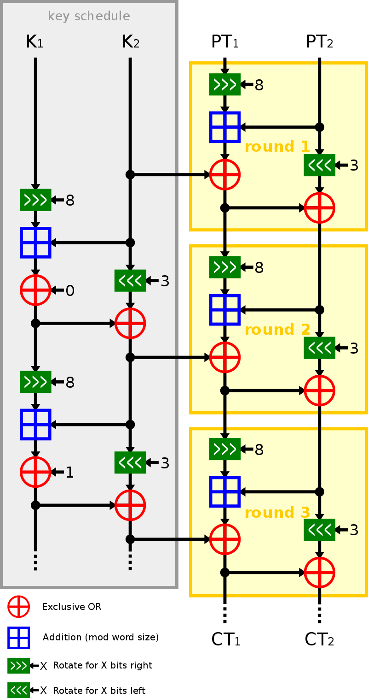

# Simon and Speck
Simon and Speck are lightweight block ciphers publicly released by the National Security Agency in June 2013. Speck has been optimized for software implementations, and Simon has been optimized for hardware implementations. 

## Installation and Test
* make
* head /dev/urandom | tr -dc A-Za-z0-9 | head -c256 > keyfile
* echo "test" > input
* ./user simon_256_128 ECB -e keyfile input output

